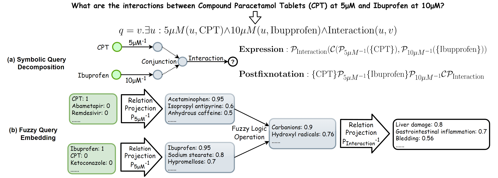

# Fuzzy-DDI



**This is the data and code for our paper** `Fuzzy-DDI: A Interpretable Fuzzy Logic Query Model for Complex Drug-Drug Interaction Prediction`.

## Prerequisites

Make sure your local environment has the following installed:

* `cuda version < 11.0`
* `pytorch>=1.7.1 & <=1.9`
* `wandb == 0.9.7`

## Datastes

We provide the dataset in the [data](data/) folder.

| Data | Source | Description |
| --- | --- | --- |
| [Drugbank](data/drugbank/)| [This link](https://bitbucket.org/kaistsystemsbiology/deepddi/src/master/data/) | A drug-drug interaction network betweeen 1,709 drugs with 136,351 interactions. |
| [TWOSIDES](data/TWOSIDES/) | [This link](http://snap.stanford.edu/biodata/datasets/10017/10017-ChChSe-Decagon.html) | A drug-drug interaction network betweeen 645 drugs with 46,221 interactions. |
| [DrugCombDB](data/DrugCombDB) | [This link](http://drugcombdb.denglab.org/) | An integrated biomedical network contains more than 4 million drugs and other entities. We extract a subgraph dataset containing the relationship "*drug-dose-target-response*" from it.|

## Documentation

```
--src
  │--README.md
  │--constants.py
  │--dataloader.py
  │--fuzzyreasoning.py
  │--gumbel.py
  │--investigation helper.py
  │--main.py
  │--models.py
  │--operations.py
  │--regularizers.py
  │--run.sh
  │--test-pretrained-model.py
  │--util.py
  
--data
  │--Drugbank
  |--TWOSIDES
  |--DrugCombDB
```

## Train

Training script example: `bash ./src/run.sh`

On a single NVIDIA® GeForce RTX™ 4090 (24GB) GPU, a typical run takes 4 days to one week to complete. On two NVIDIA® Tesla® V100 (32GB) GPUs, a typical run takes 3 to 5 days to complete.

*TODO: More training scripts for easy training will be added soon.*

## Test

The trained model will be automatically stored under the folder `./trained_models`. The model name will be `[WANDB_RUN_NAME].pt`.

To test a trained model, you can use the following command:

```
python ./src/test-pretrained-model.py [DATA_NAME] [WANDB_RUN_NAME]
```

*TODO: More pretrained models will be uploaded soon.*

## Authors

**Junkai Cheng** @github.com/Cheng0829 \
**Email:** chengjunkai829@gmail.com & Cheng0829@dlmu.edu.cn \
**Site:** [GitHub](https://github.com/Cheng0829)
